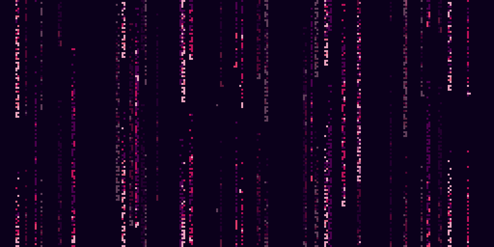

<h1 align="center">Hi, I'm David 👋</h1>

## About me :
Backend Engineer specialized in Python, with hands-on experience building APIs and production systems for B2B environments.

Over the past 2+ years, I have worked on developing backend services to expose machine learning models and data pipelines, contributing across the full lifecycle — from data processing to deployment in cloud environments.

My core focus is backend engineering: designing robust APIs, writing maintainable code, and building systems that scale. I have practical experience with FastAPI/Flask, relational databases, and containerized deployments using Docker.

I bring a strong background in Machine Learning and MLOps, which allows me to integrate ML capabilities into real-world systems when they add value — always grounded in solid engineering principles.

Currently, I am focused on strengthening my backend engineering skills and evolving towards MLOps and Data Engineering, with a growing interest in system design, distributed systems, and data-intensive applications.

**Current focus**:
- Backend development with Python (APIs, architecture, services)
- Database design and SQL (PostgreSQL)
- Scalable systems and clean architecture
- ML integration in production environments

**Open to**:
- Backend engineering roles (Python)
- API development and system design projects
- Collaborations involving backend + data/ML systems

## Skills:

#### Languages:

&nbsp;

#### ML/DL

&nbsp;
&nbsp;
&nbsp;
&nbsp;

#### Database

&nbsp;

#### Tools and Technologies

&nbsp;
&nbsp;

#### IDEs

&nbsp;
&nbsp;

## Projects

<table>
<tr>
  <td width="50%" valign="top">
    <h3 align="center">LeetCode Challenges</h3>
    

      
      

        
      

      
Implementación en código Python de soluciones a los diferentes retos de programación disponibles en LeetCode. Se trata de un proyecto en constante actualización.

    

  </td>
  
  <td width="50%" valign="top">
    <h3 align="center">Calculadora Web (HTML, CSS, JavaScript)</h3>
    

      
      

        
      

      
Implementación de una calculadora web utilizando HTML, CSS y JavaScript. Se trata de un proyecto inicial de introducción a las tecnologías Frontend.

    

  </td>
</tr>

<tr>
  <td width="50%" valign="top">
    <h3 align="center">ToDo List (HTML, CSS, JavaScript)</h3>
    

      
      

        
      

      
Implementación de una lista de tareas (ToDo List) utilizando HTML, CSS y JavaScript. Se trata de un proyecto inicial de introducción a las tecnologías Frontend.

    

  </td>
  
  <td width="50%" valign="top">
    <h3 align="center">Voice2TextJS</h3>
    

      
      

        
      

      
Aplicación de escritorio desarrollada con Electron que permite transcribir audio a texto utilizando Whisper.cpp.

    

  </td>
</tr>
<tr>
  <td colspan="2" valign="top">
    <h3 align="center">Image Gallery App (HTML, CSS, JavaScript)</h3>
    

      
      

        
      

      
Implementación de una galería de imágenes (Image Gallery) utilizando HTML, CSS y JavaScript. Se trata de un proyecto inicial de introducción a las tecnologías Frontend.

    

  </td>
</tr>
</table>

##  Connect with me:

  
  

 

    
        
    
    
        
    

---

