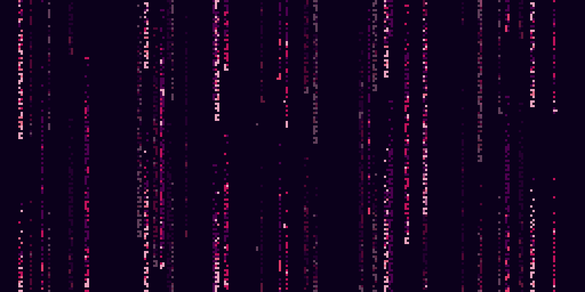

<h1 align="center">Hi, I'm David 👋</h1>

 
 

Python | Mahine Learning | Deep Learning
## Sobre mi :sunglasses:
I'm becoming a Machine Learning Developer!.

En mi perfil añado repositorios con los proyectos que voy desarrollando utilizando Python y otras tecnologías.

Cada uno de estos repositorios está enfocado en un tipo de desarrollo y/o problema. Se especifica más información de cada uno dentro del README de descripción.
El código de los proyectos/ejercicios también se encuenta ordenado, de modo que la navegación entre cada uno de ellos sea mas fácil e intuitiva.

## Tecnologías :fire:
- Python.
- Scikit Learn.
- Tensorflow.

**Lenguajes y Herramientas:**  

<code></code>
<code></code>
<code></code>

##  Contacta conmigo :speech_balloon:
  

 

    
        
    
    
        
    

---

